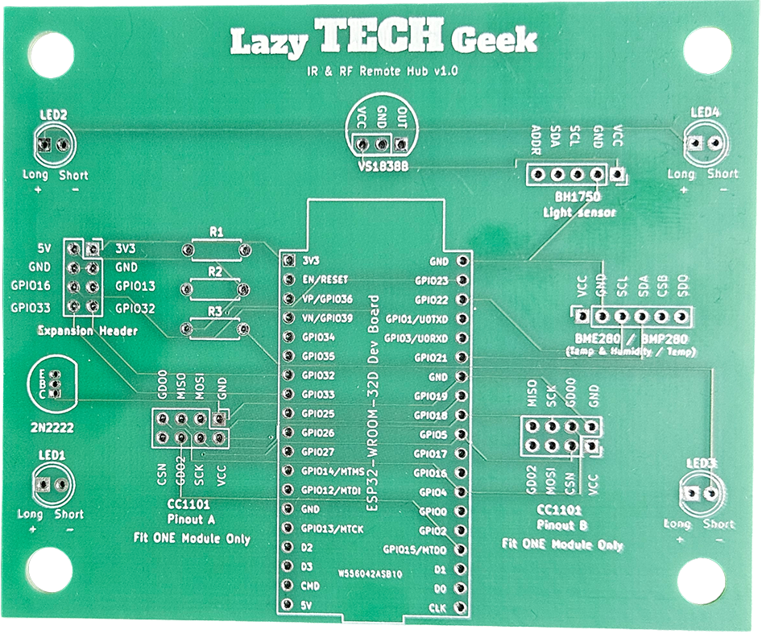
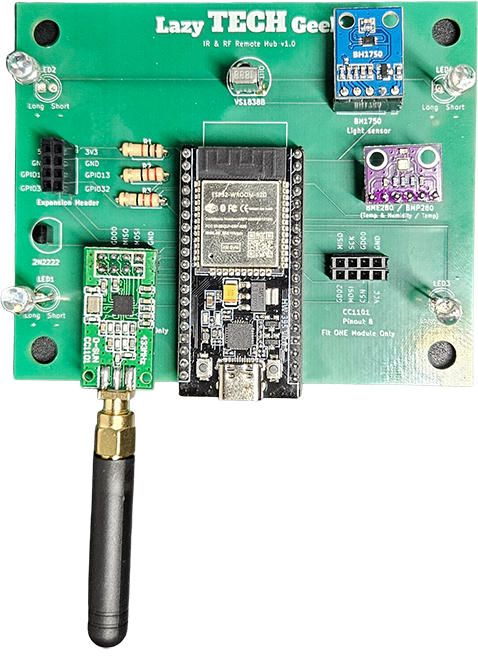
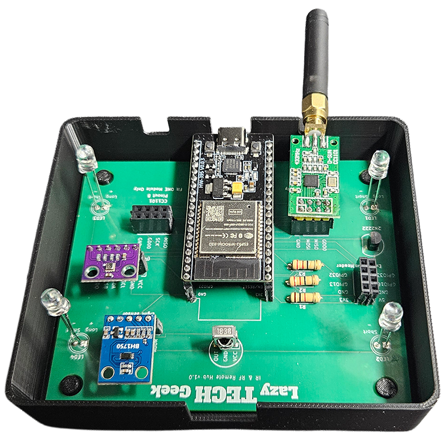
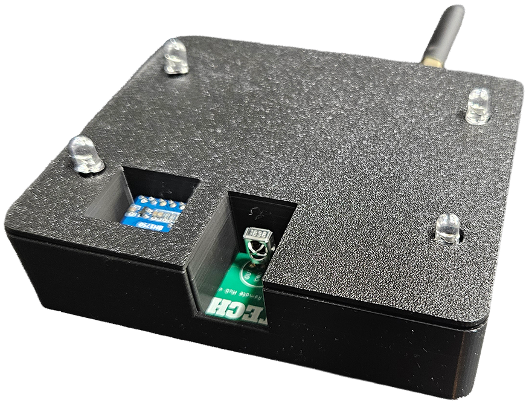
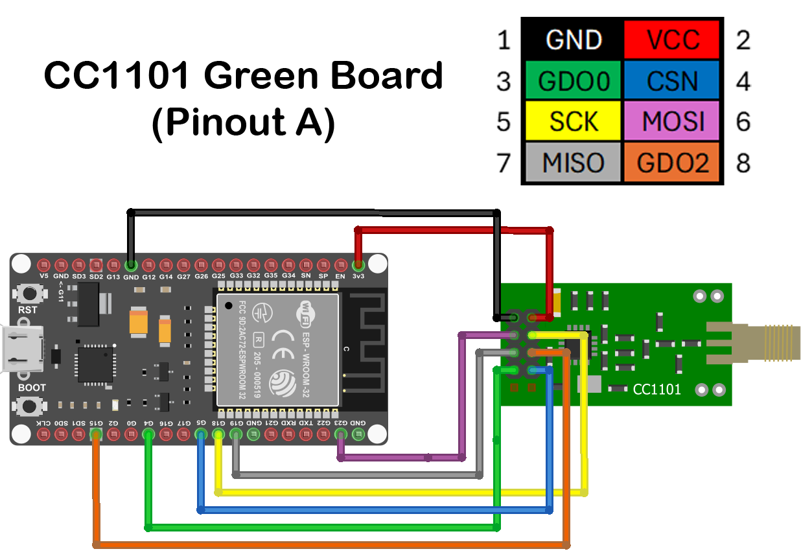
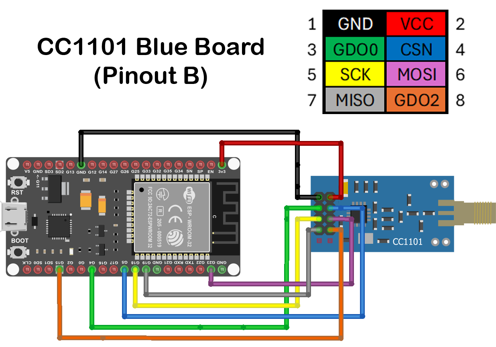

# RF in Home Assistant (Part 1 & 2)

In this video I'll show you how to integrate RF control into ESPHome and Home Assistant. We'll clone an existing RF remote, create buttons to control devices like motorised curtains, and set up automations so Home Assistant can do it all for you.

## Watch the video here:
▶️ [RF in Home Assistant](https://youtu.be/6pxcRFqvYDg)

## 🔧 Resources
[IR/RF Log Extractor](https://lazytechgeek.github.io/HomeAssistant-RF/)

## 🛒 Parts List

> As an Amazon Associate I earn from qualifying purchases at no extra cost to you.

### RF & ESP32 ONLY

- [ESP32 Dev Board x1 (38-pin, requires both 3.3V and 5V pins)](https://www.amazon.co.uk/dp/B0CNYM28CK?tag=lazytechgeekshop-21) *(pack of 3)*
- [Female-to-Female Jumper Wires](https://www.amazon.co.uk/dp/B0BLZC3SQ2?tag=lazytechgeekshop-21) *(40-piece kit, 10cm)*
- **CC1101 433MHz RF Module (Choose One)**
  - [Green PCB Version (Pinout A)](https://www.amazon.co.uk/dp/B09WKGYFPV?tag=lazytechgeekshop-21)
  - [Blue PCB Version (Pinout B)](https://www.amazon.co.uk/dp/B0DQL117RW?tag=lazytechgeekshop-21)

### RF, IR PCB Option
- [Carrier PCB V1.3 Gerbers](https://raw.githubusercontent.com/LazyTechGeek/HomeAssistant-RF/main/assets/carrier_pcb_v1.3_gerbers.zip)
- [ESP32 Dev Board x1 (38-pin, requires both 3.3V and 5V pins)](https://www.amazon.co.uk/dp/B0CNYM28CK?tag=lazytechgeekshop-21) *(pack of 3)*
- **CC1101 433MHz RF Module (Choose One)**
  - [Green PCB Version (Pinout A)](https://www.amazon.co.uk/dp/B09WKGYFPV?tag=lazytechgeekshop-21)
  - [Blue PCB Version (Pinout B)](https://www.amazon.co.uk/dp/B0DQL117RW?tag=lazytechgeekshop-21)
- [2N2222 NPN Transistor x1](https://www.amazon.co.uk/dp/B0CPBR1FGB?tag=lazytechgeekshop-21)
- 22Ω Resistors x2
- 1kΩ Resistor x1
  - [Resistor Assortment Kit](https://www.amazon.co.uk/dp/B09MMBPSH9?tag=lazytechgeekshop-21)
- IR Transmitter LEDs x4 (5mm, 940nm)
- VS1838B IR Receiver x1
  - [IR LED & Receiver Kit](https://www.amazon.co.uk/dp/B09NN5VXHX?tag=lazytechgeekshop-21)

## 🖨️ 3D Print Files
- [IR RF Hub Enclosure Base](https://raw.githubusercontent.com/LazyTechGeek/HomeAssistant-RF/main/assets/ir_rf_hub_enclosure_base.3mf)
- [IR RF Hub Enclosure Lid](https://raw.githubusercontent.com/LazyTechGeek/HomeAssistant-RF/main/assets/ir_rf_hub_enclosure_lid.3mf)
- [IR LED Guide](https://raw.githubusercontent.com/LazyTechGeek/HomeAssistant-RF/main/assets/ir_led_guide.3mf)
- [IR Receiver Guide](https://raw.githubusercontent.com/LazyTechGeek/HomeAssistant-RF/main/assets/ir_receiver_guide.3mf)

- ## 🧩 PCB Files
- [Carrier PCB V1.3 Gerbers](https://raw.githubusercontent.com/LazyTechGeek/HomeAssistant-RF/main/assets/carrier_pcb_v1.3_gerbers.zip)
## PCB
<table align="center">
<tr>
<td>

</td>
<td>

</td>
</tr>
</table>

## 3D Printed Enclosure

<table align="center">
<tr>
<td>

</td>
<td>

</td>
</tr>
</table>

## CC1101 Pinout A & B Wiring Diagrams

> [!NOTE]
> Two common CC1101 variants exist with different pin layouts. Identify your module using the images below and follow the corresponding wiring diagram.

<table>
<tr>
<td width="60%">



</td>
<td width="40%" valign="top">

#### ESP32 GPIO Mapping

| Function | ESP32 Pin |
|----------|-----------|
| GND | GND |
| VCC | 3.3V |
| MOSI | GPIO23 |
| SCK | GPIO18 |
| MISO | GPIO19 |
| GDO2 | GPIO15 |
| GDO0 | GPIO4 |
| CSN | GPIO5 |

</td>
</tr>
</table>

<table>
<tr>
<td width="60%">



</td>
<td width="40%" valign="top">

#### ESP32 GPIO Mapping

| Function | ESP32 Pin |
|----------|-----------|
| GND | GND |
| VCC | 3.3V |
| GDO0 | GPIO4 |
| CSN | GPIO5 |
| SCK | GPIO18 |
| MOSI | GPIO23 |
| MISO | GPIO19 |
| GDO2 | GPIO15 |

</td>
</tr>
</table>

## ESPHome YAML
## RF Only (Breadboard)
```yaml
substitutions:
  ############################################################
  # 1. DEVICE SETTINGS - change these for your own device
  ############################################################

  device_name: your-device-name
  friendly_name: Your Device Name

  api_encryption_key: "YOUR_API_ENCRYPTION_KEY"
  ota_password: "YOUR_OTA_PASSWORD"
  ap_ssid: "IR RF Hub Fallback Hotspot"
  ap_password: "YOUR_FALLBACK_PASSWORD"

  ############################################################
  # 2. SET GPIO PINS - change these to match your wiring / PCB
  ############################################################

  # SPI pins used by the CC1101 RF module
  spi_clk_pin: GPIO18
  spi_mosi_pin: GPIO23
  spi_miso_pin: GPIO19

  # CC1101 RF module pins
  cc1101_cs_pin: GPIO5
  remote_receiver_rf_pin: GPIO15
  remote_transmitter_rf_pin: GPIO4

  ############################################################
  # 3. ADVANCED RF SETTINGS - usually leave these alone
  ############################################################
  cc1101_frequency: "433.92MHz"
  cc1101_output_power: "10"
  cc1101_symbol_rate: "5000"
  cc1101_filter_bandwidth: "200kHz"

  rf_carrier_duty_percent: "100%"
  rf_receiver_tolerance: "50%"
  rf_receiver_filter: "200us"
  rf_receiver_idle: "40ms"

  ############################################################
  # End of substitutions
  ############################################################

esphome:
  name: ${device_name}
  friendly_name: ${friendly_name}

esp32:
  board: esp32dev
  framework:
    type: esp-idf

logger:

api:
  encryption:
    key: ${api_encryption_key}

ota:
  - platform: esphome
    password: ${ota_password}

web_server:
  port: 80

wifi:
  ssid: !secret wifi_ssid
  password: !secret wifi_password
  ap:
    ssid: ${ap_ssid}
    password: ${ap_password}

captive_portal:

spi:
  clk_pin: ${spi_clk_pin}
  mosi_pin: ${spi_mosi_pin}
  miso_pin: ${spi_miso_pin}
  
cc1101:
  id: cc1101_module
  cs_pin: ${cc1101_cs_pin}
  frequency: ${cc1101_frequency}
  output_power: ${cc1101_output_power}
  modulation_type: ASK/OOK
  symbol_rate: ${cc1101_symbol_rate}
  filter_bandwidth: ${cc1101_filter_bandwidth}

remote_receiver:
  - id: rf_receiver
    pin: ${remote_receiver_rf_pin}
    tolerance: ${rf_receiver_tolerance}
    filter: ${rf_receiver_filter}
    idle: ${rf_receiver_idle}
    dump: all

remote_transmitter:
  - id: rf_transmitter
    pin: ${remote_transmitter_rf_pin}
    carrier_duty_percent: ${rf_carrier_duty_percent}
    non_blocking: true
    on_transmit:
      then:
        - cc1101.begin_tx: cc1101_module
    on_complete:
      then:
        - cc1101.begin_rx: cc1101_module

button:
  ##############################################################
  # BUILT-IN BUTTONS - do not remove these
  ##############################################################

  - platform: restart
    name: "Restart"

  # ADD YOUR OWN RF BUTTONS BELOW - see README: https://github.com/LazyTechGeek/HomeAssistant-RF
```
## Full PCB (IR, RF, Light & Temp)
```YAML

substitutions:
  ############################################################
  # 1. DEVICE SETTINGS - change these for your own device
  ############################################################

  device_name: your-device-name
  friendly_name: Your Device Name

  api_encryption_key: "YOUR_API_ENCRYPTION_KEY"
  ota_password: "YOUR_OTA_PASSWORD"
  ap_ssid: "IR RF Hub Fallback Hotspot"
  ap_password: "YOUR_FALLBACK_PASSWORD"

  ############################################################
  # 2. SET GPIO PINS - change these to match your wiring / PCB
  ############################################################

  # SPI pins used by the CC1101 RF module
  spi_clk_pin: GPIO18
  spi_mosi_pin: GPIO23
  spi_miso_pin: GPIO19

  # CC1101 RF module pins
  cc1101_cs_pin: GPIO5
  remote_receiver_rf_pin: GPIO15
  remote_transmitter_rf_pin: GPIO4

  # IR module pins
  remote_receiver_ir_pin: GPIO27
  remote_transmitter_ir_pin: GPIO26

  # I2C pins used by BH1750 and BME280/BMP280 sensors
  i2c_sda_pin: GPIO21
  i2c_scl_pin: GPIO22

  ############################################################
  # 3. ADVANCED RF SETTINGS - usually leave these alone
  ############################################################
  cc1101_frequency: "433.92MHz"
  cc1101_output_power: "10"
  cc1101_symbol_rate: "5000"
  cc1101_filter_bandwidth: "200kHz"

  rf_carrier_duty_percent: "100%"
  rf_receiver_tolerance: "50%"
  rf_receiver_filter: "200us"
  rf_receiver_idle: "40ms"

  ############################################################
  # 4. ADVANCED IR SETTINGS - usually leave these alone
  ############################################################
  ir_carrier_duty_percent: "50%"
  ir_receiver_filter: "50us"
  ir_receiver_idle: "10ms"
  ir_receiver_input: "true"
  ir_receiver_pullup: "true"
  ir_receiver_inverted: "true"
  ir_receiver_buffer_size: "10kb"
  ir_receiver_tolerance: "25%"

############################################################
# End of substitutions
# Most users should only need to edit the device settings,
# GPIO pins, and the buttons later in this file.
############################################################

esphome:
  name: ${device_name}
  friendly_name: ${friendly_name}

esp32:
  board: esp32dev
  framework:
    type: esp-idf

logger:

api:
  encryption:
    key: ${api_encryption_key}

ota:
  - platform: esphome
    password: ${ota_password}

web_server:
  port: 80

wifi:
  ssid: !secret wifi_ssid
  password: !secret wifi_password
  ap:
    ssid: ${ap_ssid}
    password: ${ap_password}

captive_portal:

spi:
  clk_pin: ${spi_clk_pin}
  mosi_pin: ${spi_mosi_pin}
  miso_pin: ${spi_miso_pin}
  
cc1101:
  id: cc1101_module
  cs_pin: ${cc1101_cs_pin}
  frequency: ${cc1101_frequency}
  output_power: ${cc1101_output_power}
  modulation_type: ASK/OOK
  symbol_rate: ${cc1101_symbol_rate}
  filter_bandwidth: ${cc1101_filter_bandwidth}

i2c:
  # Shared I2C bus for BH1750 (light) and BME280/BMP280 (temp/pressure/humidity) 
  sda: ${i2c_sda_pin}
  scl: ${i2c_scl_pin}
  scan: true
  id: bus_a

remote_receiver:
  - id: rf_receiver
    pin: ${remote_receiver_rf_pin}
    tolerance: ${rf_receiver_tolerance}
    filter: ${rf_receiver_filter}
    idle: ${rf_receiver_idle}
    dump: all   # see README for full protocol list and how to filter
    # https://github.com/LazyTechGeek/HomeAssistant-RF

  - id: ir_receiver
    pin:
      number: ${remote_receiver_ir_pin}
      inverted: ${ir_receiver_inverted}
      mode:
        input: ${ir_receiver_input}
        pullup: ${ir_receiver_pullup}
    filter: ${ir_receiver_filter}
    idle: ${ir_receiver_idle}
    buffer_size: ${ir_receiver_buffer_size}
    tolerance: ${ir_receiver_tolerance}    
    dump: all    # see README for full protocol list and how to filter
    # https://github.com/LazyTechGeek/HomeAssistant-IR

remote_transmitter:
  - id: rf_transmitter
    pin: ${remote_transmitter_rf_pin}
    carrier_duty_percent: ${rf_carrier_duty_percent}
    non_blocking: true
    on_transmit:
      then:
        - cc1101.begin_tx: cc1101_module
    on_complete:
      then:
        - cc1101.begin_rx: cc1101_module

  - id: ir_transmitter
    pin: ${remote_transmitter_ir_pin}
    carrier_duty_percent: ${ir_carrier_duty_percent}
    non_blocking: true

button:
  ##############################################################
  # BUILT-IN BUTTONS - do not remove these
  ##############################################################

  - platform: restart
    name: "Restart"

  # ADD YOUR OWN RF BUTTONS BELOW - see README: https://github.com/LazyTechGeek/HomeAssistant-RF

sensor:
  ##########################################
  # LIGHT SENSOR: BH1750 - remove if unused
  ##########################################

  - platform: bh1750
    name: "BH1750 Illuminance"
    address: 0x23
    update_interval: 60s

  ###############################################################
  # TEMP SENSOR: Use ONE only - comment out the other
  ###############################################################

  # OPTION 1: BME280 - includes humidity (recommended)
  - platform: bme280_i2c
    address: 0x76   # or 0x77 depending on SDO
    temperature:
      name: "BME280 Temperature"
    pressure:
      name: "BME280 Pressure"
    humidity:
      name: "BME280 Humidity"

  # OPTION 2: BMP280 - no humidity (comment out OPTION 1 above first)
  # - platform: bmp280_i2c
  #   address: 0x76   # or 0x77 depending on SDO
  #   temperature:
  #     name: "BMP280 Temperature"
  #   pressure:
  #     name: "BMP280 Pressure"

  # ADD YOUR OWN SENSORS BELOW
```
&nbsp;
## Dump Filters
### Infrared
```yaml

remote_receiver:
  - id: rf_receiver
    pin: ${remote_receiver_rf_pin}
    tolerance: ${rf_receiver_tolerance}
    filter: ${rf_receiver_filter}
    idle: ${rf_receiver_idle}
    dump: all   # OPTION 1: Use this for initial setup to see all protocols

   # OPTION 2: Once you know your protocols, replace 'dump: all' with specific list:
   # dump:
   #   - aeha         # AEHA infrared codes
   #   - beo4         # B&O Beo4 infrared codes
   #   - canalsat     # CanalSat infrared codes (56kHz)
   #   - canalsatld   # CanalSatLD infrared codes (56kHz)
   #   - coolix       # Coolix infrared codes
   #   - dish         # Dish infrared codes (57.6kHz - many receivers won't decode)
   #   - dyson        # Dyson Cool AM7 fan codes
   #   - jvc          # JVC infrared codes
   #   - gobox        # Go-Box infrared codes
   #   - haier        # Haier infrared codes
   #   - lg           # LG infrared codes
   #   - magiquest    # MagiQuest wand infrared codes
   #   - midea        # Midea infrared codes
   #   - nec          # NEC infrared codes (most common - cheap/generic remotes)
   #   - panasonic    # Panasonic infrared codes
   #   - pioneer      # Pioneer infrared codes
   #   - rc5          # RC5 infrared codes
   #   - rc6          # RC6 infrared codes
   #   - roomba       # Roomba infrared codes
   #   - samsung      # Samsung infrared codes
   #   - samsung36    # Samsung36 infrared codes
   #   - symphony     # Symphony infrared codes
   #   - sony         # Sony infrared codes
   #   - toshiba_ac   # Toshiba AC infrared codes
   #   - mirage       # Mirage infrared codes
   #   - toto         # Toto infrared codes
   #   - pronto       # Universal raw format - use if no protocol matches
```
### RF
```yaml
remote_receiver:
  - id: rf_receiver
    pin: ${remote_receiver_rf_pin}
    tolerance: ${rf_receiver_tolerance}
    filter: ${rf_receiver_filter}
    idle: ${rf_receiver_idle}
    dump: all   # OPTION 1: Use this for initial setup to see all protocols

    # OPTION 2: Once you know your protocols, replace 'dump: all' with specific list:
    # dump:
    #   - rc_switch    # Most common 433MHz remotes
    #   - nexa         # Nexa RF codes
    #   - keeloq       # KeeLoq RF codes
    #   - pronto       # Print remote code in Pronto form. Useful for using arbitrary protocols.
```
### Raw
```yaml
remote_receiver:
  - id: rf_receiver
    pin: ${remote_receiver_rf_pin}
    tolerance: ${rf_receiver_tolerance}
    filter: ${rf_receiver_filter}
    idle: ${rf_receiver_idle}
    dump: raw  # Raw timing dump - last resort fallback
```
&nbsp;
## 🔘 RF Button Examples by Protocol
https://esphome.io/components/remote_transmitter/
⚠️ These go under <code><b>button:</b></code> in your ESPHome config
&nbsp;
## Restart button
```yaml
# BUILT IN BUTTONS
  - platform: restart
    name: "Restart"
```

## Raw
```yaml
  - platform: template
    name: "NAME_OF_BUTTON"       # ← this can be anything you like
    on_press:
      - remote_transmitter.transmit_raw:
          transmitter_id: rf_transmitter  # ← do not change this
          code:
            [
            # ← paste your values from dump output here
            # e.g. 771, -275, 240, -746, 511, -240, 775...
            ]
```

## RC Switch Raw
```yaml
  - platform: template
    name: "NAME_OF_BUTTON"       # ← this can be anything you like
    on_press:
      - remote_transmitter.transmit_rc_switch_raw:
          transmitter_id: rf_transmitter  # ← do not change this
          code: 'YOUR_CODE'               # ← from dump output e.g. '101000111111011011101000'
          protocol: 1                     # ← from dump output e.g. protocol=1
          repeat:
            times: 5                      # ← most receivers need multiple repeats to trigger reliably
            wait_time: 10ms               # ← delay between each repeat
```

## RC Switch Type A (DIP switch style remotes)
```yaml
  - platform: template
    name: "NAME_OF_BUTTON"  # ← this can be anything you like
    on_press:
      - remote_transmitter.transmit_rc_switch_type_a:
          transmitter_id: rf_transmitter  # ← do not change this
          group: 'YOUR_GROUP'             # ← from dump output e.g. '01001'
          device: 'YOUR_DEVICE'           # ← from dump output e.g. '10110'
          state: on                       # ← on/off state to send
          protocol: 1                     # ← from dump output e.g. protocol=1
```

## RC Switch Type B:
```yaml
  - platform: template
    name: "NAME_OF_BUTTON"        # ← this can be anything you like
    on_press:
      - remote_transmitter.transmit_rc_switch_type_b:
          transmitter_id: rf_transmitter  # ← do not change this
          address: YOUR_ADDRESS           # ← from dump output e.g. 1
          channel: YOUR_CHANNEL           # ← from dump output e.g. 3
          state: on                       # ← on/off state to send
          protocol: 1                     # ← from dump output e.g. protocol=1
```

## RC Switch Type C:
```yaml
  - platform: template
    name: "NAME_OF_BUTTON"        # ← this can be anything you like
    on_press:
      - remote_transmitter.transmit_rc_switch_type_c:
          transmitter_id: rf_transmitter  # ← do not change this
          family: 'YOUR_FAMILY'           # ← from dump output e.g. 'c' (range: a to p)
          group: YOUR_GROUP               # ← from dump output e.g. 3 (range: 1 to 4)
          device: YOUR_DEVICE             # ← from dump output e.g. 1 (range: 1 to 4)
          state: ON                       # ← on/off state to send
          protocol: 1                     # ← from dump output e.g. protocol=1
```

## RC Switch Type D:
```yaml
  - platform: template
    name: "NAME_OF_BUTTON"        # ← this can be anything you like
    on_press:
      - remote_transmitter.transmit_rc_switch_type_d:
          transmitter_id: rf_transmitter  # ← do not change this
          group: 'YOUR_GROUP'             # ← from dump output e.g. 'c' (range: a to d)
          device: YOUR_DEVICE             # ← from dump output e.g. 1 (range: 1 to 3)
          state: on                       # ← on/off state to send
          protocol: 1                     # ← from dump output e.g. protocol=1
```

## Nexa (popular in Scandinavia):
```yaml
  - platform: template
    name: "NAME_OF_BUTTON"        # ← this can be anything you like
    on_press:
      - remote_transmitter.transmit_nexa:
          transmitter_id: rf_transmitter  # ← do not change this
          device: YOUR_DEVICE             # ← from dump output e.g. 0x38DDB4A
          state: 1                        # ← 0 = off, 1 = on, 2 = dimmer level
          group: YOUR_GROUP               # ← from dump output e.g. 0
          channel: YOUR_CHANNEL           # ← from dump output e.g. 15
          level: YOUR_LEVEL               # ← from dump output e.g. 0 (dimmer level)
```

## Drayton
```yaml
  - platform: template
    name: "Open-curtain"       # ← this can be anything you like
    on_press:
      - remote_transmitter.transmit_drayton:
          transmitter_id: rf_transmitter
          address: 'YOUR_ADDRESS'         # ← The 16-bit ID to send, see dumper output for more info
          channel: 'YOUR_CHANNEL'         # ← The switch/channel to send, between 0 and 127 inclusive
          command: 'YOUR_COMMAND'         # ← The command to send, between 0 and 63 inclusive
```

## KeeLoq (garage doors/car remotes):
```yaml
  - platform: template
    name: "NAME_OF_BUTTON"        # ← this can be anything you like
    on_press:
      - remote_transmitter.transmit_keeloq:
          transmitter_id: rf_transmitter  # ← do not change this
          address: 'YOUR_ADDRESS'         # ← from dump output e.g. '0x57ffe7b'
          command: 'YOUR_COMMAND'         # ← from dump output e.g. '0x02'
          code: 'YOUR_CODE'               # ← from dump output e.g. '0xd19ef0a9'
          repeat:
            times: 3                      # ← recommended minimum for KeeLoq
            wait_time: 15ms               # ← matches HCS301 chip timing
```

## Pronto (universal fallback):
```yaml
  - platform: template
    name: "NAME_OF_BUTTON"        # ← this can be anything you like
    on_press:
      - remote_transmitter.transmit_pronto:
          transmitter_id: rf_transmitter
          data: >-
            YOUR_PRONTO_DATA              # ← from dump output e.g. 0000 006D 0010 0000 0008 0020...
```
&nbsp;
## 🤖 Automations
⚠️ These go in your Home Assistant automations, not ESPHome
&nbsp;
## Close Curtains via RF When Away
```yaml
alias: Close curtains when away
description: Automatically closes the curtains when everyone has left home.
triggers:

    # Detect when a person has been away from home for 2 minutes   
  - trigger: state
    entity_id:
      - person.YOUR_PERSON_ENTITY
    for:
      hours: 0
      minutes: 2
      seconds: 0
    from:
      - home
conditions: []
actions:
    # Close curtains        
  - action: button.press
    metadata: {}
    target:
      entity_id: button.YOUR_CURTAIN_CLOSE_BUTTON
    data: {}
mode: single
```

# RF & IR Control in Home Assistant – Trigger Automations with Any Remote | ESPHome

Following on from the previous video, this time I'll show you how to use RF and IR remotes with ESPHome and Home Assistant. We'll capture button presses from existing remotes, create binary sensors for each button, and use them to trigger Home Assistant automations.

"This video continues from the RF/IR Hub project. This time, we'll focus on using spare or old RF and IR remotes — when you press a button, it triggers an automation in Home Assistant. We'll start with this base code as our foundation."

## Watch the video here:
▶️ [Use Old IR & RF Remotes to Trigger Home Assistant Automations](PENDING)


##  Base Code
## RF Only (Breadboard) — Part 2 Base Code
```yaml
substitutions:
  ############################################################
  # 1. DEVICE SETTINGS - change these for your own device
  ############################################################

  device_name: your-device-name
  friendly_name: Your Device Name

  api_encryption_key: "YOUR_API_ENCRYPTION_KEY"
  ota_password: "YOUR_OTA_PASSWORD"
  ap_ssid: "IR RF Hub Fallback Hotspot"
  ap_password: "YOUR_FALLBACK_PASSWORD"

  ############################################################
  # 2. SET GPIO PINS - change these to match your wiring / PCB
  ############################################################

  # SPI pins used by the CC1101 RF module
  spi_clk_pin: GPIO18
  spi_mosi_pin: GPIO23
  spi_miso_pin: GPIO19

  # CC1101 RF module pins
  cc1101_cs_pin: GPIO5
  remote_receiver_rf_pin: GPIO15
  remote_transmitter_rf_pin: GPIO4

  ############################################################
  # 3. ADVANCED RF SETTINGS - usually leave these alone
  ############################################################
  cc1101_frequency: "433.92MHz"
  cc1101_output_power: "10"
  cc1101_symbol_rate: "5000"
  cc1101_filter_bandwidth: "200kHz"

  rf_carrier_duty_percent: "100%"
  rf_receiver_tolerance: "50%"
  rf_receiver_filter: "200us"
  rf_receiver_idle: "40ms"

  ############################################################
  # End of substitutions
  ############################################################

esphome:
  name: ${device_name}
  friendly_name: ${friendly_name}

esp32:
  board: esp32dev
  framework:
    type: esp-idf

logger:

api:
  encryption:
    key: ${api_encryption_key}
  batch_delay: 0ms  # Send state changes immediately

ota:
  - platform: esphome
    password: ${ota_password}

web_server:
  port: 80

wifi:
  ssid: !secret wifi_ssid
  password: !secret wifi_password
  ap:
    ssid: ${ap_ssid}
    password: ${ap_password}

captive_portal:

spi:
  clk_pin: ${spi_clk_pin}
  mosi_pin: ${spi_mosi_pin}
  miso_pin: ${spi_miso_pin}
  
cc1101:
  id: cc1101_module
  cs_pin: ${cc1101_cs_pin}
  frequency: ${cc1101_frequency}
  output_power: ${cc1101_output_power}
  modulation_type: ASK/OOK
  symbol_rate: ${cc1101_symbol_rate}
  filter_bandwidth: ${cc1101_filter_bandwidth}

remote_receiver:
  - id: rf_receiver
    pin: ${remote_receiver_rf_pin}
    tolerance: ${rf_receiver_tolerance}
    filter: ${rf_receiver_filter}
    idle: ${rf_receiver_idle}
    dump: all

  ##############################################################
  # ADD YOUR RF AUTOMATIONS (on_* triggers) BELOW
  ##############################################################

remote_transmitter:
  - id: rf_transmitter
    pin: ${remote_transmitter_rf_pin}
    carrier_duty_percent: ${rf_carrier_duty_percent}
    non_blocking: true
    on_transmit:
      then:
        - cc1101.begin_tx: cc1101_module
    on_complete:
      then:
        - cc1101.begin_rx: cc1101_module

button:
  ##############################################################
  # BUILT-IN BUTTONS - do not remove these
  ##############################################################

  - platform: restart
    name: "Restart"

  # ADD YOUR OWN RF BUTTONS BELOW - see README: https://github.com/LazyTechGeek/HomeAssistant-RF

binary_sensor:
  # ADD YOUR BINARY SENSORS BELOW

```
## Full PCB (IR, RF, Light & Temp) — Part 2 Base Code
```YAML

substitutions:
  ############################################################
  # 1. DEVICE SETTINGS - change these for your own device
  ############################################################

  device_name: your-device-name
  friendly_name: Your Device Name

  api_encryption_key: "YOUR_API_ENCRYPTION_KEY"
  ota_password: "YOUR_OTA_PASSWORD"
  ap_ssid: "IR RF Hub Fallback Hotspot"
  ap_password: "YOUR_FALLBACK_PASSWORD"

  ############################################################
  # 2. SET GPIO PINS - change these to match your wiring / PCB
  ############################################################

  # SPI pins used by the CC1101 RF module
  spi_clk_pin: GPIO18
  spi_mosi_pin: GPIO23
  spi_miso_pin: GPIO19

  # CC1101 RF module pins
  cc1101_cs_pin: GPIO5
  remote_receiver_rf_pin: GPIO15
  remote_transmitter_rf_pin: GPIO4

  # IR module pins
  remote_receiver_ir_pin: GPIO27
  remote_transmitter_ir_pin: GPIO26

  # I2C pins used by BH1750 and BME280/BMP280 sensors
  i2c_sda_pin: GPIO21
  i2c_scl_pin: GPIO22

  ############################################################
  # 3. ADVANCED RF SETTINGS - usually leave these alone
  ############################################################
  cc1101_frequency: "433.92MHz"
  cc1101_output_power: "10"
  cc1101_symbol_rate: "5000"
  cc1101_filter_bandwidth: "200kHz"

  rf_carrier_duty_percent: "100%"
  rf_receiver_tolerance: "50%"
  rf_receiver_filter: "200us"
  rf_receiver_idle: "40ms"

  ############################################################
  # 4. ADVANCED IR SETTINGS - usually leave these alone
  ############################################################
  ir_carrier_duty_percent: "50%"
  ir_receiver_filter: "50us"
  ir_receiver_idle: "10ms"
  ir_receiver_input: "true"
  ir_receiver_pullup: "true"
  ir_receiver_inverted: "true"
  ir_receiver_buffer_size: "10kb"
  ir_receiver_tolerance: "25%"

############################################################
# End of substitutions
# Most users should only need to edit the device settings,
# GPIO pins, and the buttons later in this file.
############################################################

esphome:
  name: ${device_name}
  friendly_name: ${friendly_name}

esp32:
  board: esp32dev
  framework:
    type: esp-idf

logger:

api:
  encryption:
    key: ${api_encryption_key}
  batch_delay: 0ms  # Send state changes immediately

ota:
  - platform: esphome
    password: ${ota_password}

web_server:
  port: 80

wifi:
  ssid: !secret wifi_ssid
  password: !secret wifi_password
  ap:
    ssid: ${ap_ssid}
    password: ${ap_password}

captive_portal:

spi:
  clk_pin: ${spi_clk_pin}
  mosi_pin: ${spi_mosi_pin}
  miso_pin: ${spi_miso_pin}
  
cc1101:
  id: cc1101_module
  cs_pin: ${cc1101_cs_pin}
  frequency: ${cc1101_frequency}
  output_power: ${cc1101_output_power}
  modulation_type: ASK/OOK
  symbol_rate: ${cc1101_symbol_rate}
  filter_bandwidth: ${cc1101_filter_bandwidth}

i2c:
  # Shared I2C bus for BH1750 (light) and BME280/BMP280 (temp/pressure/humidity) 
  sda: ${i2c_sda_pin}
  scl: ${i2c_scl_pin}
  scan: true
  id: bus_a

remote_receiver:
  - id: rf_receiver
    pin: ${remote_receiver_rf_pin}
    tolerance: ${rf_receiver_tolerance}
    filter: ${rf_receiver_filter}
    idle: ${rf_receiver_idle}
    dump: all   # see README for full protocol list and how to filter
    # https://github.com/LazyTechGeek/HomeAssistant-RF

  ##############################################################
  # # ADD YOUR RF AUTOMATIONS (on_* triggers) BELOW
  ##############################################################

  - id: ir_receiver
    pin:
      number: ${remote_receiver_ir_pin}
      inverted: ${ir_receiver_inverted}
      mode:
        input: ${ir_receiver_input}
        pullup: ${ir_receiver_pullup}
    filter: ${ir_receiver_filter}
    idle: ${ir_receiver_idle}
    buffer_size: ${ir_receiver_buffer_size}
    tolerance: ${ir_receiver_tolerance}    
    dump: all    # see README for full protocol list and how to filter
    # https://github.com/LazyTechGeek/HomeAssistant-IR

  ##############################################################
  # # ADD YOUR IR AUTOMATIONS (on_* triggers) BELOW
  ##############################################################

remote_transmitter:
  - id: rf_transmitter
    pin: ${remote_transmitter_rf_pin}
    carrier_duty_percent: ${rf_carrier_duty_percent}
    non_blocking: true
    on_transmit:
      then:
        - cc1101.begin_tx: cc1101_module
    on_complete:
      then:
        - cc1101.begin_rx: cc1101_module

  - id: ir_transmitter
    pin: ${remote_transmitter_ir_pin}
    carrier_duty_percent: ${ir_carrier_duty_percent}
    non_blocking: true

button:
  ##############################################################
  # BUILT-IN BUTTONS - do not remove these
  ##############################################################

  - platform: restart
    name: "Restart"

  # ADD YOUR OWN RF BUTTONS BELOW - see README: https://github.com/LazyTechGeek/HomeAssistant-RF

sensor:
  ##############################################################
  # LIGHT SENSOR: BH1750 - remove if unused
  ##############################################################

  - platform: bh1750
    name: "BH1750 Illuminance"
    address: 0x23
    update_interval: 60s

  ###############################################################
  # TEMP SENSOR: Use ONE only - comment out the other
  ###############################################################

  # OPTION 1: BME280 - includes humidity (recommended)
  - platform: bme280_i2c
    address: 0x76   # or 0x77 depending on SDO
    temperature:
      name: "BME280 Temperature"
    pressure:
      name: "BME280 Pressure"
    humidity:
      name: "BME280 Humidity"

  # OPTION 2: BMP280 - no humidity (comment out OPTION 1 above first)
  # - platform: bmp280_i2c
  #   address: 0x76   # or 0x77 depending on SDO
  #   temperature:
  #     name: "BMP280 Temperature"
  #   pressure:
  #     name: "BMP280 Pressure"

  # ADD YOUR OWN SENSORS BELOW

binary_sensor:
  # ADD YOUR BINARY SENSORS BELOW


```

## 🔘 ESPHome Automations by Protocol

⚠️ Place these automations nested under your <code><b>remote_receiver:</b></code> as shown in this example

```yaml
# EXAMPLE CODE

remote_receiver:
  - id: rf_receiver
    pin: ${remote_receiver_rf_pin}
    tolerance: ${rf_receiver_tolerance}
    filter: ${rf_receiver_filter}
    idle: ${rf_receiver_idle}
    dump: all     # see README for full protocol list and how to filter
    # https://github.com/LazyTechGeek/HomeAssistant-RF

  - id: ir_receiver
    pin:
      number: ${remote_receiver_ir_pin}
      inverted: ${ir_receiver_inverted}
      mode:
        input: ${ir_receiver_input}
        pullup: ${ir_receiver_pullup}
    filter: ${ir_receiver_filter}
    idle: ${ir_receiver_idle}
    buffer_size: ${ir_receiver_buffer_size}
    tolerance: ${ir_receiver_tolerance}    
    dump: all    # see README for full protocol list and how to filter

# PLACE IT HERE

  on_samsung:
    then:
    - if:
        condition:
          or:
            - lambda: 'return (x.data == 0xE0E0E01F);'  # VOL+ newer type
            - lambda: 'return (x.data == 0xE0E0E01F0);' # VOL+ older type
        then:
          - ...
```

## TEMPLATE 1: Single code, single action
```yaml
    on_PROTOCOL:      # e.g. on_samsung, on_nec, on_lg, on_jvc, on_rc_switch, on_raw
      then:
        - if:
            condition:
              lambda: 'return (x.data == ENTER_CODE_HERE);'
            then:
              - homeassistant.service:
                  service: DOMAIN.ACTION        # e.g. switch.turn_off, light.turn_on
                  data:
                    entity_id: DOMAIN.ENTITY    # e.g. switch.sonoff_kitchen
```
## TEMPLATE 2: Single code, multiple actions
```yaml
    on_PROTOCOL:      # e.g. on_samsung, on_nec, on_lg, on_jvc, on_rc_switch, on_raw
      then:
        - if:
            condition:
              lambda: 'return (x.data == ENTER_CODE_HERE);'
            then:
              - homeassistant.service:
                  service: DOMAIN.ACTION
                  data:
                    entity_id: DOMAIN.ENTITY
              - homeassistant.service:
                  service: DOMAIN.ACTION
                  data:
                    entity_id: DOMAIN.ENTITY
```
## TEMPLATE 3: Multiple codes, single action
```yaml
    on_PROTOCOL:      # e.g. on_samsung, on_nec, on_lg, on_jvc, on_rc_switch, on_raw
      then:
        - if:
            condition:
              or:
                - lambda: 'return (x.data == ENTER_CODE_HERE);'
                - lambda: 'return (x.data == ENTER_CODE_HERE);'
            then:
              - homeassistant.service:
                  service: DOMAIN.ACTION
                  data:
                    entity_id: DOMAIN.ENTITY
```
## TEMPLATE 4: Multiple codes, multiple actions
```yaml
    on_PROTOCOL:      # e.g. on_samsung, on_nec, on_lg, on_jvc, on_rc_switch, on_raw
      then:
        - if:
            condition:
              or:
                - lambda: 'return (x.data == ENTER_CODE_HERE);'
                - lambda: 'return (x.data == ENTER_CODE_HERE);'
            then:
              - homeassistant.service:
                  service: DOMAIN.ACTION
                  data:
                    entity_id: DOMAIN.ENTITY
              - homeassistant.service:
                  service: DOMAIN.ACTION
                  data:
                    entity_id: DOMAIN.ENTITY
```

## 🔘 Binary sensors by Protocol
⚠️ These go under <code><b>binary_sensor:</b></code> in your ESPHome config
&nbsp;

⚠️ Add the key value <code><b> batch_delay: 0ms</b></code> under api: in your ESPHome config, otherwise the binary sensor data doesn't update.
## Example
```YAML
api:
  encryption:
    key: ${api_encryption_key}
  batch_delay: 0ms  # Send state changes immediately
```

## RC Switch Raw
```YAML
  - platform: remote_receiver
    receiver_id: rf_receiver          # ← do not change this
    name: "NAME_OF_BINARY_SENSOR"     # ← this can be anything you like
    rc_switch_raw:
      code: 'YOUR_CODE'               # ← from dump output e.g. '101000111111011011101000'    
      protocol: 1                     # ← from dump output e.g. protocol=1
```

## Raw
```YAML
  - platform: remote_receiver
    receiver_id: rf_receiver          # ← do not change this
    name: "NAME_OF_BINARY_SENSOR"     # ← this can be anything you like
    raw:
      code: [YOUR_CODE]               # ← from dump output e.g. [743, -312, 211, -774, 744, -281]
```
&nbsp;
## 🤖 Automations
⚠️ These go in your Home Assistant automations, not ESPHome
&nbsp;
## Demo automation showing how to trigger actions from binary sensor button presses.
```yaml
alias: RF Remote Example Automation
description: >
  Example automation for a 4-button RF remote. Each button press triggers a
  different action. Replace the binary_sensor and target entity_id values with
  your own.
triggers:

  # Button 1 — replace entity_id with your binary sensor name
  - trigger: state
    entity_id:
      - binary_sensor.YOUR_REMOTE_BUTTON_1
    from:
      - "off"
      - "on"
    id: "1"

  # Button 2 — replace entity_id with your binary sensor name
  - trigger: state
    entity_id:
      - binary_sensor.YOUR_REMOTE_BUTTON_2
    from:
      - "off"
      - "on"
    id: "2"

  # Button 3 — replace entity_id with your binary sensor name
  - trigger: state
    entity_id:
      - binary_sensor.YOUR_REMOTE_BUTTON_3
    from:
      - "off"
      - "on"
    id: "3"

  # Button 4 — replace entity_id with your binary sensor name
  - trigger: state
    entity_id:
      - binary_sensor.YOUR_REMOTE_BUTTON_4
    from:
      - "off"
      - "on"
    id: "4"

conditions: []
actions:
  - choose:

      # Action for Button 1 — replace entity_id with your target device
      - conditions:
          - condition: trigger
            id:
              - "1"
        sequence:
          - action: switch.turn_on
            metadata: {}
            target:
              entity_id: switch.YOUR_SWITCH
            data: {}

      # Action for Button 2 — replace entity_id with your target device
      - conditions:
          - condition: trigger
            id:
              - "2"
        sequence:
          - action: switch.turn_off
            metadata: {}
            target:
              entity_id: switch.YOUR_SWITCH
            data: {}

      # Action for Button 3 — replace entity_id with your target device
      - conditions:
          - condition: trigger
            id:
              - "3"
        sequence:
          - action: cover.open_cover
            metadata: {}
            target:
              entity_id:
                - cover.YOUR_COVER_1
                - cover.YOUR_COVER_2
                - cover.YOUR_COVER_3
            data: {}

      # Action for Button 4 — replace entity_id with your target device
      - conditions:
          - condition: trigger
            id:
              - "4"
        sequence:
          - action: cover.close_cover
            metadata: {}
            target:
              entity_id:
                - cover.YOUR_COVER_1
                - cover.YOUR_COVER_2
                - cover.YOUR_COVER_3
            data: {}
mode: single
```
